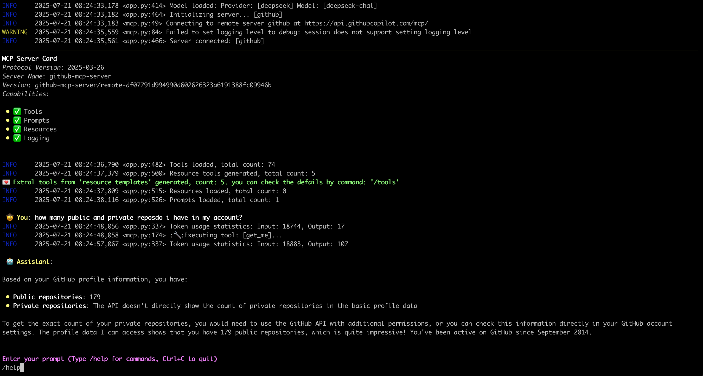

# MCPCLIHost 🤖

A CLI host application that enables Large Language Models (LLMs) to interact with external tools through the Model Context Protocol (MCP). Currently supports Openai, Azure Openai, Deepseek and Ollama models.

English | [简体中文](./README-zh.md)

## What it looks like: 🤠


## Features ✨

- Interactive conversations with multipe LLM models
- Support for multiple concurrent MCP servers
- Dynamic tool discovery and integration
- Configurable MCP server locations and arguments
- Configurable message history window for context management
- Monitor/trace error from server side
- Support Sampling, Roots, Elicitation, retrievling Resource, Prompts
- Support runtime exclude specific tool
- Show MCP server card when connected

## Latest Update 💌
- [2025-07-18] Support Streamable HTTP mcp server, OAuth process not support yet
- [2025-07-02] Support Elicitation
- [2025-06-27] Deal with `Prompts` in MCP server: [Link](./docs/prompts_usage.md)
- [2025-06-20] Deal with `Resources` in MCP server: [Link](./docs/resource_templates_implements.md)

## Environment Setup 🔧

1. For Openai and Deepseek:
```bash
export OPENAI_API_KEY='your-api-key'
```
By default for Openai the `base_url` is "https://api.openai.com/v1"
For deepseek it's "https://api.deepseek.com", you can change it by `--base-url`

2. For Ollama, need setup firstly:
- Install Ollama from https://ollama.ai
- Pull your desired model:
```bash
ollama pull mistral
```
- Ensure Ollama is running:
```bash
ollama serve
```
3. For Azure Openai:
```bash
export AZURE_OPENAI_DEPLOYMENT='your-azure-deployment'
export AZURE_OPENAI_API_KEY='your-azure-openai-api-key'
export AZURE_OPENAI_API_VERSION='your-azure-openai-api-version'
export AZURE_OPENAI_ENDPOINT='your-azure-openai-endpoint'
```
4. For Google Gemini
```bash
export GEMINI_API_KEY='your-gemini-api-token'
```

## Installation 📦

```bash
pip install mcp-cli-host
```

## Configuration ⚙️

MCPCLIHost will automatically find configuration file at `~/.mcp.json`. You can also specify a custom location using the `--config` flag:

### STDIO mcp server
```json
{
  "mcpServers": {
    "sqlite": {
      "command": "uvx",
      "args": [
        "mcp-server-sqlite",
        "--db-path",
        "/tmp/foo.db"
      ]
    },
    "filesystem": {
      "command": "npx",
      "args": [
        "-y",
        "@modelcontextprotocol/server-filesystem",
        "/tmp"
      ]
    }
  }
}
```

Each MCP server entry requires:
- `command`: The command to run (e.g., `uvx`, `npx`) 
- `args`: Array of arguments for the command:
  - For SQLite server: `mcp-server-sqlite` with database path
  - For filesystem server: `@modelcontextprotocol/server-filesystem` with directory path

### Remote mcp server(only support Streamable HTTP)
```json
{
  "mcpServers": {
    "github": {
      "url": "https://api.githubcopilot.com/mcp/",
      "headers": {"Authorization": "Bearer <your PAT>"}
    }
  }
}
```

## Usage 🚀

MCPCLIHost is a CLI tool that allows you to interact with various AI models through a unified interface. It supports various tools through MCP servers.

### Available Models
Models can be specified using the `--model` (`-m`) flag:
- Deepseek: `deepseek:deepseek-chat`
- OpenAI: `openai:gpt-4`
- Ollama models: `ollama:modelname`
- Azure Openai: `azure:gpt-4-0613`
- Gemini: `gemini:gemini-2.5-flash`

### Examples
```bash
# Use Ollama with Qwen model
mcpclihost -m ollama:qwen2.5:3b

# Use Deepseek
mcpclihost -m deepseek:deepseek-chat --sys-prompt 'You are a slightly playful assistant, please answer questions in a cute tone!'
```

### Flags
- `--config string`: Config file location (default is $HOME/mcp.json)
- `--debug`: Enable debug logging
- `--message-window int`: Number of messages to keep in context (default: 10)
- `-m, --model string`: Model to use (format: provider:model) (default "anthropic:claude-3-5-sonnet-latest")
- `--base-url string`: Base URL for OpenAI API (defaults to api.openai.com)
- `--roots string`:  MCP clients to expose filesystem “roots” to servers
- `--sys-prompt string`: System prompt

### Interactive Commands

While chatting, you can use:
- `/help`: Show available commands
- `/tools`: List all available tools
- `/exclude_tool tool_name`: Exclude specific tool from the conversation
- `/resources`: List all available resources
- `/get_resource`: Get specific resources by uri, example: /get_resource resource_uri
- `/prompts`: List all available prompts
- `/get_prompt`: Get specific prompt by name, example: /get_prompt prompt_name
- `/servers`: List configured MCP servers
- `/history`: Display conversation history
- `/quit`: Exit at any time


## MCP Server Compatibility 🔌

MCPCliHost can work with any MCP-compliant server. For examples and reference implementations, see the [MCP Servers Repository](https://github.com/modelcontextprotocol/servers).

## Known issues 🐛
- In scenario of `Sampling` and `Elicitation`, when typing "Ctrl+c", the process will crash with something like `asyncio.exceptions.CancelledError`, will be resolved later.

## License 📄

This project is licensed under the Apache 2.0 License - see the [LICENSE](LICENSE) file for details.
