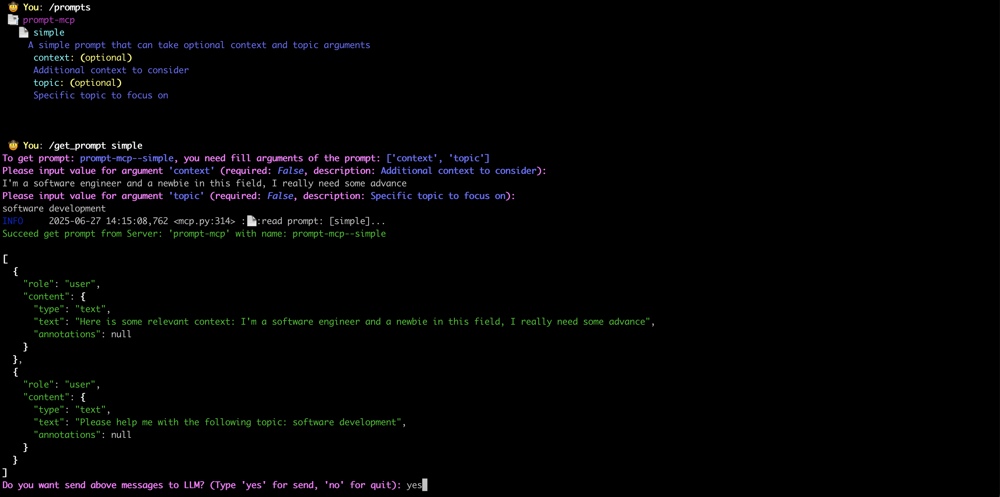

# Prompts of MCP server

`Prompts` capability in MCP server is another issue in community: how to leverage these `prompts`?
- Ask LLM to select more suitable prompt for specific topic and invole them in converdation?
- or Let user to pick up one they preferred?

I think all options is not incorrect, see the official expression:
from https://modelcontextprotocol.io/specification/2025-06-18/server/prompts
"Prompts are designed to be user-controlled, meaning they are exposed from servers to clients with the intention of the user being able to explicitly select them for use."

Depends on implements of Client.

So in `mcp-cli-host`, we help user get the content of `Prompts`(with `arguments`) and ask user if they want to send then to LLM for a converation.

