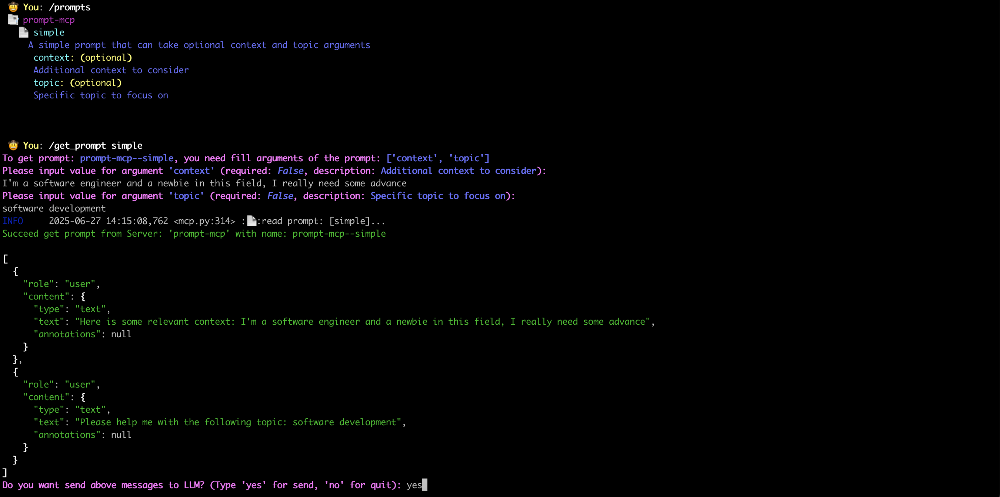

# MCP服务器的提示词功能
关于MCP服务器的`Prompts`（提示词）功能，社区存在一个争议点：如何有效利用这些预设提示词？
- 方案A：让LLM根据对话主题自动选择最合适的提示词
- 方案B：由用户手动选择他们偏好的提示词

官方文档已明确表态：
> "提示词的设计是用户可控的，服务器向客户端暴露这些提示词的目的是为了让用户能够显式选择使用方式。"  
> ——引自[MCP规范文档](https://modelcontextprotocol.io/specification/2025-06-18/server/prompts)

这意味着具体实现取决于**客户端设计**。在`mcp-cli-host`中，我们采用如下交互流程：
1. 帮助用户获取提示词内容（含参数化模板）
2. 询问用户是否将该提示词发送给LLM进行对话生成  
