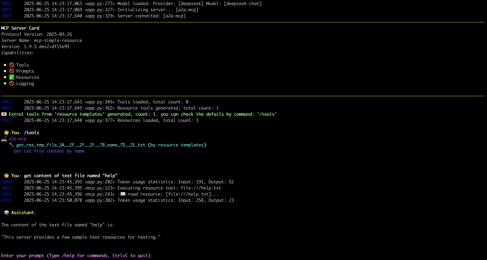

# MCP服务器的资源机制
其实我一直对"资源"(Resources)这个概念感到困惑：如果目标是支持内容检索，为何不直接让工具(Tools)来处理这类任务？我的意思是直接提供查询相关内容的工具（官方解释这类似于REST API中的`get`操作）。

后来我发现了关键差异：
根据[官方文档-工具概念](https://modelcontextprotocol.io/docs/concepts/tools)：
"工具(Tools)的设计是模型可控的，即服务器向客户端暴露工具的意图是让AI模型能够自动调用它们（需经人工批准）。"

这与资源的概念不同：
根据[官方文档-资源概念](https://modelcontextprotocol.io/docs/concepts/resources)：
"资源(Resources)的设计是应用可控的，客户端应用可以自主决定使用方式和时机。不同的MCP客户端可能以不同方式处理资源。"

这样就说得通了——可以理解为用户通过`resources/list`查看服务器提供的资源，再用`resources/read`获取感兴趣的内容：**这个过程不涉及LLM**，对吗？

但`资源模板`(Resource Templates)又该如何解释？像URI模板（`file:///{path}`, `{scheme}://{host}/api`）这种形式，看起来非常像`工具`(Tools)，你只需要通过参数获取URI（可能由LLM驱动）。

因此在`mcp-cli-host`中，我们将`资源模板`转换为特定工具，这样就能与LLM结合使用，如图所示：
